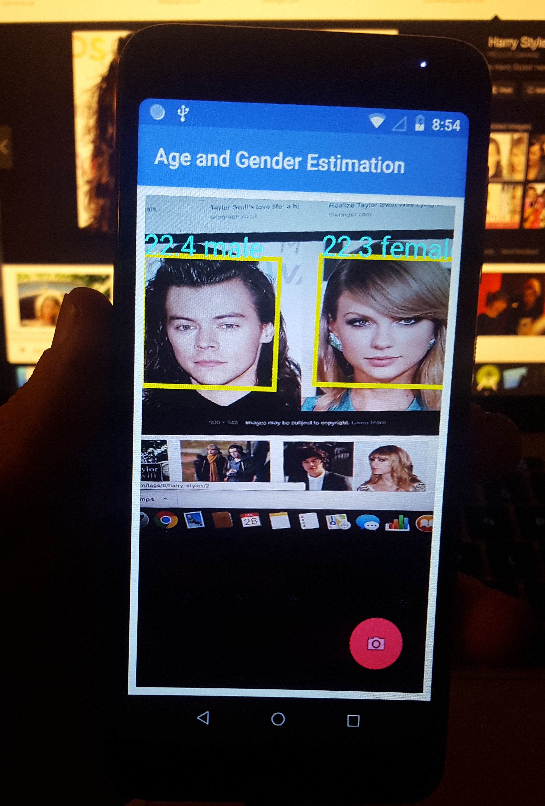

# real-time-age-gender-estimation-android

Using a pretrained gender model from [SSR-Net](https://github.com/shamangary/SSR-Net) and a pretrained age model from [rude-carnie](https://github.com/dpressel/rude-carnie), camera images are processed in real-time with the following pipeline:

1. Camera image is fed into an on-device ML Kit firebase face detection model that outputs the locations of all faces in the image
2. The faces are then cropped from the original image and scaled to 3 channel, 64x64 bitmaps and 3 channel, 227x227 bitmaps
3. These face bitmaps are fed into an gender detection model and a separate age detection model, respectively.
4. The output age range and gender is overlayed atop each face in the original image.

## Example Usage

